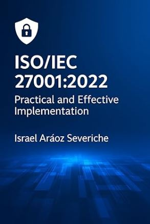
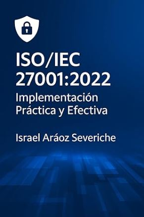
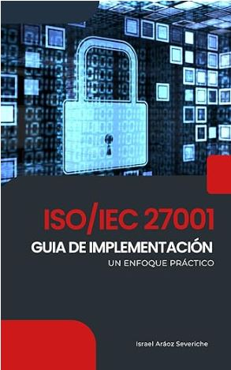

# 👋 Hello! I'm Israel Araoz Severiche

## 🛡️ Cybersecurity Engineer

I specialize in:

- **Application Security**: Conducting penetration tests on web and mobile applications.
- **API REST Pentesting**: Assessing security and performing penetration tests on APIs.
- **Incident Response and Digital Forensics**: Managing incidents and conducting forensic analyses.

## 🏆 Notable Achievements

- **ISO 27001 Implementation**: Led the implementation of ISO 27001 standards and achieved international certification for Bolivia's two largest oil refineries, enhancing information security in critical infrastructure.

## 📚 My Books

  
  
  

## 🛠️ Technical Skills

- **Programming Languages**:   
- **Security Tools**:      
- **Cloud Platforms**:  

## 📝 Personal Blog

I share my knowledge and experiences in cybersecurity on my personal blog on Medium:

## 🌐 Connect with Me

